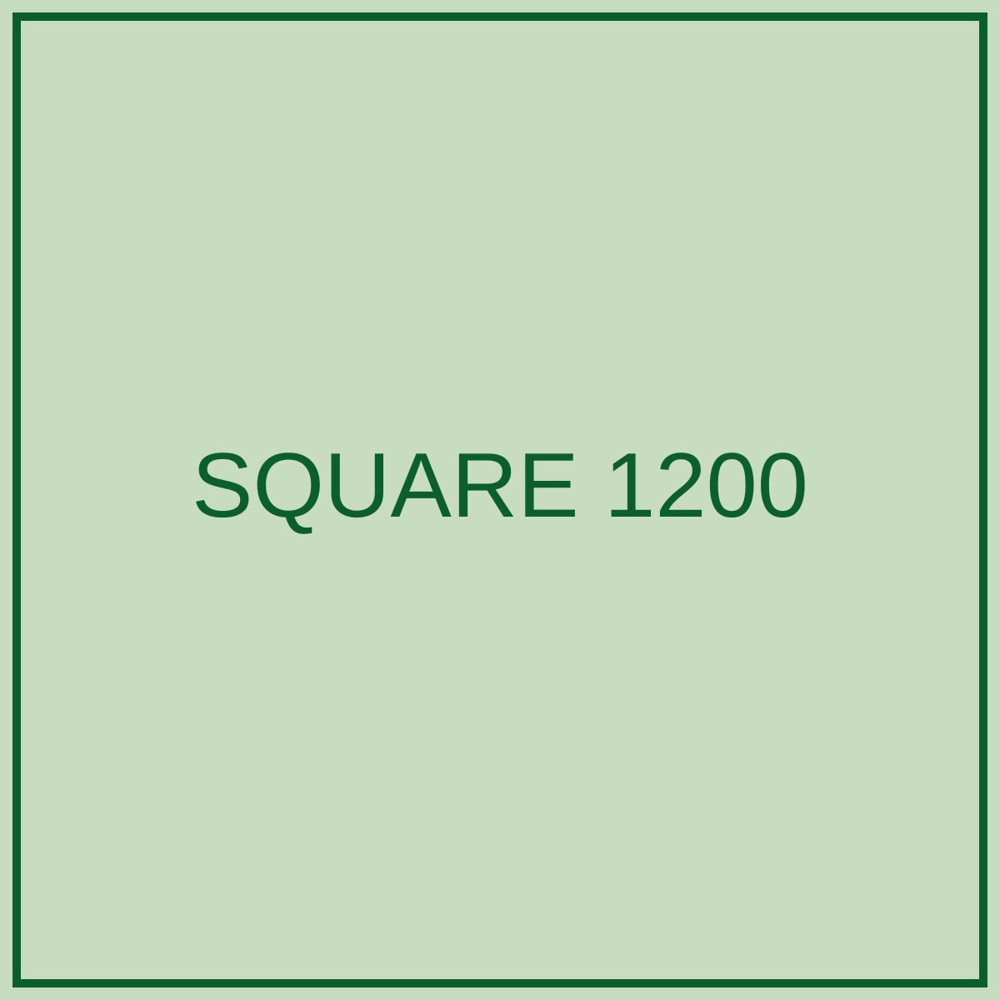

# Backgrounds {.section-header-bg .subtitle-section-header}

## Normal slide

The default surface is beige with ink body text and a green heading. The rule
under the heading ties the right-aligned `h2` to the left-aligned body.

- Bullets carry a green marker and 0.45em spacing
- `inline code` sits in a tinted green chip
- **Bold** text picks up dark green

::: {.smalltext-p}
`.smalltext-p` — was HSG blue on beige at 1.7:1, now dark green at 5.5:1.
:::

::: {.rightalign-p}
`.rightalign-p` — same change, right aligned.
:::

## Centered block

::: {.center-middle}
`.center-middle` centers a block vertically and horizontally.

The minimum height is 60vh so the block clears the logo band.
:::

## Quote slide {.quote-slide-bg}

::: {.quote-p}
`.quote-p` now uses white on dark green with a yellow rule, instead of HSG blue
at 3.1:1.
:::

::: {.source-p}
`.source-p` — beige on dark green, 5.5:1
:::

## Callout {.image-slide-bg}

::: {.callout-slide-p}
`.callout-slide-p` on the white `.image-slide-bg` surface. The invalid
`font-weight: 110` is now 400.
:::

::: {.source-p-blue}
`.source-p-blue` — dark green, right aligned
:::

# Color surfaces {.section-header-bg .subtitle-section-header}

## Green slide {.green-slide-bg}

::: {.white-text-p}
White on HSG green is 5.1:1 and stays white. The logo switches to the white
variant.
:::

## Dark green slide {.darkgreen-slide-bg}

::: {.white-text-p}
`.darkgreen-slide-bg` is new. White on dark green is 7.8:1, the strongest of the
brand surfaces.
:::

## Blue slide {.blue-slide-bg}

::: {.white-text-p}
White text and the white logo on HSG blue, at 2.5:1.
:::

## Red slide {.red-slide-bg}

::: {.white-text-p}
White text on coral, at 3.1:1.
:::

## Yellow slide {.yellow-slide-bg}

::: {.white-text-p}
The yellow surface had no text rules at all, so white text was invisible at
1.2:1. Ink on yellow is 12.1:1, and the logo stays the colour version.
:::

## Green slide no underline {.green-slide-no-underline-bg}

::: {.white-text-p}
No rule under the heading. Compare with `.green-slide-bg` above.
:::

### Subheading

## Dark green slide no underline {.darkgreen-slide-no-underline-bg}

::: {.white-text-p}
No rule under the heading. Compare with `.darkgreen-slide-bg` above.
:::

## Blue slide no underline {.blue-slide-no-underline-bg}

::: {.white-text-p}
No rule under the heading. Compare with `.blue-slide-bg` above.
:::

## Red slide no underline {.red-slide-no-underline-bg}

::: {.white-text-p}
No rule under the heading. Compare with `.red-slide-bg` above.
:::

## Yellow slide no underline {.yellow-slide-no-underline-bg}

::: {.white-text-p}
No rule under the heading. Compare with `.yellow-slide-bg` above.
:::

## Image slide no underline {.image-slide-no-underline-bg}

::: {.callout-slide-p}
No rule under the heading. Compare with `.image-slide-bg` above.
:::

# Green section no underline {.green-slide-no-underline-bg}

# Content elements {.section-header-bg .subtitle-section-header}

## Blockquote and citation

> The default block quote sits on a tinted green panel with a solid green rule,
> upright rather than italic.

::: {.bib-p}
Author, A. (2024). *Title of the work.* Journal of Something, 12(3), 45–67.
:::

## Blockquote colours

::: {.bq-green}
> `.bq-green`
:::

::: {.bq-darkgreen}
> `.bq-darkgreen`
:::

::: {.bq-blue}
> `.bq-blue`
:::

::: {.bq-red}
> `.bq-red`
:::

::: {.bq-yellow}
> `.bq-yellow`
:::

## Paragraph colours

::: {.ink-p}
ink-p, the default body colour
:::

::: {.darkgreen-p}
darkgreen-p
:::

::: {.green-p}
green-p
:::

::: {.blue-p}
blue-p, 1.7:1 on beige, use it on a dark surface
:::

::: {.red-p}
red-p, 2.2:1 on beige, use it on a dark surface
:::

::: {.yellow-p}
yellow-p, 1.2:1 on beige, use it on a dark surface
:::

## Paragraph colours on dark green {.darkgreen-slide-bg}

::: {.white-text-p}
white-text-p
:::

::: {.beige-p}
beige-p
:::

::: {.blue-p}
blue-p
:::

::: {.red-p}
red-p
:::

::: {.yellow-p}
yellow-p
:::

## Table, striped

::: {.striped}
| Specification | Coefficient | Std. error | n |
|---------------|------------:|-----------:|--:|
| Baseline      |       0.412 |      0.038 | 1,204 |
| With controls |       0.377 |      0.041 | 1,204 |
| Fixed effects |       0.298 |      0.052 | 1,180 |
:::

::: {.smalltext-p}
`.striped` — dark green header, body rows alternating white and light green.
:::

## Table, plain

::: {.plain}
| Specification | Coefficient | Std. error | n |
|---------------|------------:|-----------:|--:|
| Baseline      |       0.412 |      0.038 | 1,204 |
| With controls |       0.377 |      0.041 | 1,204 |
| Fixed effects |       0.298 |      0.052 | 1,180 |
:::

::: {.smalltext-p}
`.plain` — beige throughout, dark green horizontal rules matching the header.
:::

## Code

```r
model <- lm(outcome ~ treatment + controls, data = df)
summary(model)
```

::: {.smalltext-p}
Code blocks sit on white with a green left rule, instead of the default reveal
shadow.
:::

## Tabset

::: {.panel-tabset}

### Estimates

Tabs are now underlined rather than filled, so they read as navigation instead
of buttons.

### Diagnostics

The active tab is green and bold; inactive tabs are dark green text.

:::

## Question {.green-slide-bg}

::: {.question-slide-p}
`.question-slide-p` — white on green for a discussion prompt.
:::

## Colour reference

| Surface | Text colour | Ratio |
|---------|-------------|------:|
| Beige `#e1d7c3` | ink `#1f2933` | 9.9 |
| Beige `#e1d7c3` | dark green `#0a5f2d` | 5.5 |
| Green `#00802f` | white | 5.1 |
| Dark green `#0a5f2d` | white | 7.8 |
| Dark green `#0a5f2d` | beige `#e1d7c3` | 5.5 |
| Blue `#73a5af` | white | 2.5 |
| Coral `#eb6969` | white | 3.1 |
| Yellow `#fff04b` | ink `#1f2933` | 12.1 |

::: {.smalltext-p}
HSG blue is never used for text: 1.7:1 on beige, 3.1:1 on dark green.
:::

# Layout {.section-header-bg .subtitle-section-header}

## Two columns, text only

:::: {.columns}

::: {.column width="50%"}
Left column. Some text that runs over a couple of lines so the column has a
realistic amount of content in it.

- First point
- Second point
- Third point
:::

::: {.column width="50%"}
Right column. More text on this side, again over several lines to give the
column body some height.

- Fourth point
- Fifth point
:::

::::

## Two columns, image right

:::: {.columns}

::: {.column width="45%"}
Text on the left. The image on the right should scale down to the space it has
and stay centred, without pushing this text out of the slide.

- Point one
- Point two
:::

::: {.column width="55%"}

:::

::::

## Two columns, tall image left

:::: {.columns}

::: {.column width="40%"}

:::

::: {.column width="60%"}
Text on the right. The tall image should be limited by the height of the slide,
not by the width of its column.

- Point one
- Point two
- Point three
:::

::::

## One column, tall image with caption


## One column, wide image with caption


## Text above a wide image

Some introductory text above the figure.


# Q&A

## Layered table and figures {.image-slide-bg}

::: {.r-stack}

:::: {.fragment .fade-out}

::::: {.columns}

:::::: {.column width="30%"}

| Metric | Value |
|:-------|------:|
| Unique technologies | 901 |
| Silhouette | 0.44 |
| Davies--Bouldin | 0.92 |
| Calinski--Harabasz | 459.45 |
| Trustworthiness (10D) | 0.92 |
| Inertia | 421.49 |

: Final clustering solution, k = 16.

::::::

:::::: {.column width="70%"}


::::::

:::::

::::

:::: {.fragment .fade-in-then-out}

::::: {.columns}

:::::: {.column width="30%"}

| Technology cluster | Mentions | Peak year | Peak share | *p* |
| --- | ---: | ---: | ---: | ---: |
| Algorithms & Recommendations | 103 | 2026 | 7.2% | .604 |
| AR, VR & Robots | 54 | 2026 | 6.0% | < .001 |
| Auctions & Pricing | 26 | 2007 | 5.4% | .004 |
| Computers & Software | 134 | 2000 | 21.5% | < .001 |
| Crypto & Fintech | 95 | 2026 | 10.5% | .034 |
| E-Commerce | 81 | 2000 | 11.6% | .001 |
| Gaming & Digital Platforms | 106 | 2026 | 9.4% | .002 |
| Generative AI | 225 | 2026 | 30.2% | < .001 |
| Internet & Broadcasting | 127 | 2000 | 29.4% | < .001 |
| Mobility & Transportation | 27 | 2000 | 1.8% | .942 |
| Search & Advertising | 99 | 2000 | 12.2% | .012 |
| Smartphones & Apps | 126 | 2017 | 11.9% | .041 |
| Social Media | 182 | 2016 | 24.1% | < .001 |
| Streaming, Audio & Video | 57 | 2026 | 4.6% | .153 |
| Tracking & Wearables | 56 | 2014 | 4.5% | .388 |
| Other | 85 | 2014 | 7.3% | .440 |

: Total mentions, peak year and peak share of each technology cluster.

::::::

:::::: {.column width="70%"}


::::::

:::::

::::

:::

## Oversized table alone

| Technology cluster | Mentions | Peak year | Peak share | *p* |
| --- | ---: | ---: | ---: | ---: |
| Algorithms & Recommendations | 103 | 2026 | 7.2% | .604 |
| AR, VR & Robots | 54 | 2026 | 6.0% | < .001 |
| Auctions & Pricing | 26 | 2007 | 5.4% | .004 |
| Computers & Software | 134 | 2000 | 21.5% | < .001 |
| Crypto & Fintech | 95 | 2026 | 10.5% | .034 |
| E-Commerce | 81 | 2000 | 11.6% | .001 |
| Gaming & Digital Platforms | 106 | 2026 | 9.4% | .002 |
| Generative AI | 225 | 2026 | 30.2% | < .001 |
| Internet & Broadcasting | 127 | 2000 | 29.4% | < .001 |
| Mobility & Transportation | 27 | 2000 | 1.8% | .942 |
| Search & Advertising | 99 | 2000 | 12.2% | .012 |
| Smartphones & Apps | 126 | 2017 | 11.9% | .041 |
| Social Media | 182 | 2016 | 24.1% | < .001 |
| Streaming, Audio & Video | 57 | 2026 | 4.6% | .153 |
| Tracking & Wearables | 56 | 2014 | 4.5% | .388 |
| Other | 85 | 2014 | 7.3% | .440 |

: A sixteen row table that must shrink to fit the slide, caption included.

## Table right, figure left 30/70

::: {.columns}

:::: {.column width="30%"}


::::

:::: {.column width="70%"}

| Technology cluster | Mentions | Peak year | Peak share | *p* |
| --- | ---: | ---: | ---: | ---: |
| Algorithms & Recommendations | 103 | 2026 | 7.2% | .604 |
| AR, VR & Robots | 54 | 2026 | 6.0% | < .001 |
| Auctions & Pricing | 26 | 2007 | 5.4% | .004 |
| Computers & Software | 134 | 2000 | 21.5% | < .001 |
| Crypto & Fintech | 95 | 2026 | 10.5% | .034 |
| E-Commerce | 81 | 2000 | 11.6% | .001 |
| Gaming & Digital Platforms | 106 | 2026 | 9.4% | .002 |
| Generative AI | 225 | 2026 | 30.2% | < .001 |
| Internet & Broadcasting | 127 | 2000 | 29.4% | < .001 |
| Mobility & Transportation | 27 | 2000 | 1.8% | .942 |
| Search & Advertising | 99 | 2000 | 12.2% | .012 |
| Smartphones & Apps | 126 | 2017 | 11.9% | .041 |
| Social Media | 182 | 2016 | 24.1% | < .001 |
| Streaming, Audio & Video | 57 | 2026 | 4.6% | .153 |
| Tracking & Wearables | 56 | 2014 | 4.5% | .388 |
| Other | 85 | 2014 | 7.3% | .440 |

: Sixteen row cluster table.


::::

:::

## Table right, text left 70/30

::: {.columns}

:::: {.column width="70%"}

Text beside the table. A few lines of body copy so the column has some
realistic height to it.

- Point one
- Point two
- Point three


::::

:::: {.column width="30%"}

| Technology cluster | Mentions | Peak year | Peak share | *p* |
| --- | ---: | ---: | ---: | ---: |
| Algorithms & Recommendations | 103 | 2026 | 7.2% | .604 |
| AR, VR & Robots | 54 | 2026 | 6.0% | < .001 |
| Auctions & Pricing | 26 | 2007 | 5.4% | .004 |
| Computers & Software | 134 | 2000 | 21.5% | < .001 |
| Crypto & Fintech | 95 | 2026 | 10.5% | .034 |
| E-Commerce | 81 | 2000 | 11.6% | .001 |
| Gaming & Digital Platforms | 106 | 2026 | 9.4% | .002 |
| Generative AI | 225 | 2026 | 30.2% | < .001 |
| Internet & Broadcasting | 127 | 2000 | 29.4% | < .001 |
| Mobility & Transportation | 27 | 2000 | 1.8% | .942 |
| Search & Advertising | 99 | 2000 | 12.2% | .012 |
| Smartphones & Apps | 126 | 2017 | 11.9% | .041 |
| Social Media | 182 | 2016 | 24.1% | < .001 |
| Streaming, Audio & Video | 57 | 2026 | 4.6% | .153 |
| Tracking & Wearables | 56 | 2014 | 4.5% | .388 |
| Other | 85 | 2014 | 7.3% | .440 |

: Sixteen row cluster table.


::::

:::

## Table left, figure right 70/30

::: {.columns}

:::: {.column width="70%"}

| Technology cluster | Mentions | Peak year | Peak share | *p* |
| --- | ---: | ---: | ---: | ---: |
| Algorithms & Recommendations | 103 | 2026 | 7.2% | .604 |
| AR, VR & Robots | 54 | 2026 | 6.0% | < .001 |
| Auctions & Pricing | 26 | 2007 | 5.4% | .004 |
| Computers & Software | 134 | 2000 | 21.5% | < .001 |
| Crypto & Fintech | 95 | 2026 | 10.5% | .034 |
| E-Commerce | 81 | 2000 | 11.6% | .001 |
| Gaming & Digital Platforms | 106 | 2026 | 9.4% | .002 |
| Generative AI | 225 | 2026 | 30.2% | < .001 |
| Internet & Broadcasting | 127 | 2000 | 29.4% | < .001 |
| Mobility & Transportation | 27 | 2000 | 1.8% | .942 |
| Search & Advertising | 99 | 2000 | 12.2% | .012 |
| Smartphones & Apps | 126 | 2017 | 11.9% | .041 |
| Social Media | 182 | 2016 | 24.1% | < .001 |
| Streaming, Audio & Video | 57 | 2026 | 4.6% | .153 |
| Tracking & Wearables | 56 | 2014 | 4.5% | .388 |
| Other | 85 | 2014 | 7.3% | .440 |

: Sixteen row cluster table.


::::

:::: {.column width="30%"}


::::

:::

## Table in a narrow 20% column

::: {.columns}

:::: {.column width="20%"}

| Technology cluster | Mentions | Peak year | Peak share | *p* |
| --- | ---: | ---: | ---: | ---: |
| Algorithms & Recommendations | 103 | 2026 | 7.2% | .604 |
| AR, VR & Robots | 54 | 2026 | 6.0% | < .001 |
| Auctions & Pricing | 26 | 2007 | 5.4% | .004 |
| Computers & Software | 134 | 2000 | 21.5% | < .001 |
| Crypto & Fintech | 95 | 2026 | 10.5% | .034 |
| E-Commerce | 81 | 2000 | 11.6% | .001 |
| Gaming & Digital Platforms | 106 | 2026 | 9.4% | .002 |
| Generative AI | 225 | 2026 | 30.2% | < .001 |
| Internet & Broadcasting | 127 | 2000 | 29.4% | < .001 |
| Mobility & Transportation | 27 | 2000 | 1.8% | .942 |
| Search & Advertising | 99 | 2000 | 12.2% | .012 |
| Smartphones & Apps | 126 | 2017 | 11.9% | .041 |
| Social Media | 182 | 2016 | 24.1% | < .001 |
| Streaming, Audio & Video | 57 | 2026 | 4.6% | .153 |
| Tracking & Wearables | 56 | 2014 | 4.5% | .388 |
| Other | 85 | 2014 | 7.3% | .440 |

: Sixteen row cluster table.


::::

:::: {.column width="80%"}


Text beside the table. A few lines of body copy so the column has some
realistic height to it.

- Point one
- Point two
- Point three


::::

:::

## Three columns, figure table text

::: {.columns}

:::: {.column width="30%"}


::::

:::: {.column width="40%"}

| Metric | Value |
|:-------|------:|
| Unique technologies | 901 |
| Silhouette | 0.44 |
| Davies--Bouldin | 0.92 |
| Calinski--Harabasz | 459.45 |
| Trustworthiness (10D) | 0.92 |
| Inertia | 421.49 |

: Six row metrics table.


::::

:::: {.column width="30%"}

Text beside the table. A few lines of body copy so the column has some
realistic height to it.

- Point one
- Point two
- Point three


::::

:::

## Two tables side by side

::: {.columns}

:::: {.column width="50%"}

| Technology cluster | Mentions | Peak year | Peak share | *p* |
| --- | ---: | ---: | ---: | ---: |
| Algorithms & Recommendations | 103 | 2026 | 7.2% | .604 |
| AR, VR & Robots | 54 | 2026 | 6.0% | < .001 |
| Auctions & Pricing | 26 | 2007 | 5.4% | .004 |
| Computers & Software | 134 | 2000 | 21.5% | < .001 |
| Crypto & Fintech | 95 | 2026 | 10.5% | .034 |
| E-Commerce | 81 | 2000 | 11.6% | .001 |
| Gaming & Digital Platforms | 106 | 2026 | 9.4% | .002 |
| Generative AI | 225 | 2026 | 30.2% | < .001 |
| Internet & Broadcasting | 127 | 2000 | 29.4% | < .001 |
| Mobility & Transportation | 27 | 2000 | 1.8% | .942 |
| Search & Advertising | 99 | 2000 | 12.2% | .012 |
| Smartphones & Apps | 126 | 2017 | 11.9% | .041 |
| Social Media | 182 | 2016 | 24.1% | < .001 |
| Streaming, Audio & Video | 57 | 2026 | 4.6% | .153 |
| Tracking & Wearables | 56 | 2014 | 4.5% | .388 |
| Other | 85 | 2014 | 7.3% | .440 |

: Sixteen row cluster table.


::::

:::: {.column width="50%"}

| Metric | Value |
|:-------|------:|
| Unique technologies | 901 |
| Silhouette | 0.44 |
| Davies--Bouldin | 0.92 |
| Calinski--Harabasz | 459.45 |
| Trustworthiness (10D) | 0.92 |
| Inertia | 421.49 |

: Six row metrics table.


::::

:::

## Table and figure in the same column

::: {.columns}

:::: {.column width="50%"}

| Metric | Value |
|:-------|------:|
| Unique technologies | 901 |
| Silhouette | 0.44 |
| Davies--Bouldin | 0.92 |
| Calinski--Harabasz | 459.45 |
| Trustworthiness (10D) | 0.92 |
| Inertia | 421.49 |

: Six row metrics table.


::::

:::: {.column width="50%"}

Text beside the table. A few lines of body copy so the column has some
realistic height to it.

- Point one
- Point two
- Point three


::::

:::

## Figure above a table, full width


| Technology cluster | Mentions | Peak year | Peak share | *p* |
| --- | ---: | ---: | ---: | ---: |
| Algorithms & Recommendations | 103 | 2026 | 7.2% | .604 |
| AR, VR & Robots | 54 | 2026 | 6.0% | < .001 |
| Auctions & Pricing | 26 | 2007 | 5.4% | .004 |
| Computers & Software | 134 | 2000 | 21.5% | < .001 |
| Crypto & Fintech | 95 | 2026 | 10.5% | .034 |
| E-Commerce | 81 | 2000 | 11.6% | .001 |
| Gaming & Digital Platforms | 106 | 2026 | 9.4% | .002 |
| Generative AI | 225 | 2026 | 30.2% | < .001 |
| Internet & Broadcasting | 127 | 2000 | 29.4% | < .001 |
| Mobility & Transportation | 27 | 2000 | 1.8% | .942 |
| Search & Advertising | 99 | 2000 | 12.2% | .012 |
| Smartphones & Apps | 126 | 2017 | 11.9% | .041 |
| Social Media | 182 | 2016 | 24.1% | < .001 |
| Streaming, Audio & Video | 57 | 2026 | 4.6% | .153 |
| Tracking & Wearables | 56 | 2014 | 4.5% | .388 |
| Other | 85 | 2014 | 7.3% | .440 |

: Sixteen row cluster table.

## Text, table, figure stacked

Text beside the table. A few lines of body copy so the column has some
realistic height to it.

- Point one
- Point two
- Point three

| Metric | Value |
|:-------|------:|
| Unique technologies | 901 |
| Silhouette | 0.44 |
| Davies--Bouldin | 0.92 |
| Calinski--Harabasz | 459.45 |
| Trustworthiness (10D) | 0.92 |
| Inertia | 421.49 |

: Six row metrics table.


